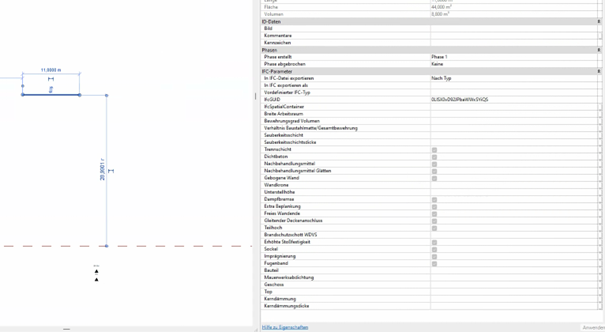
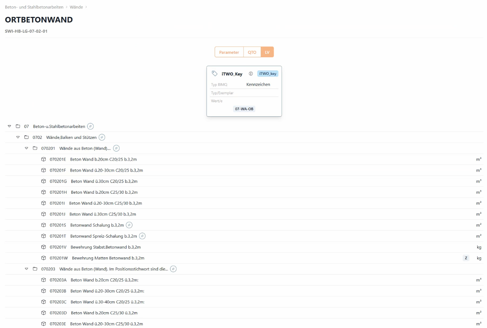
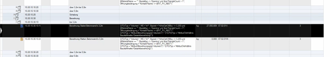

# Ortbetonwand

## 1.1.1 Beschreibung

Eine Ortbetonwand ist eine **monolithisch hergestellte Betonwand**, die direkt am Einbauort in eine Schalung betoniert wird. In der österreichischen Baupraxis und nach ÖNORM B 4700 (Stahlbetontragwerke) wird sie als tragendes oder nicht tragendes Bauteil ausgeführt.

## 1.1.2 Parameter im Überblick

Man unterscheidet allgemein zwischen Typ-Parameter und Exemplar-Parameter.

**Typ-Parameter:**

Die Parameter gelten für alle Exemplare eines bestimmten Typs.

Änderst du einen Typparameter, ändern sich alle platzierten Elemente dieses Typs.

Beispiel: Die Dicke einer Ortbetonwand vom Typ "Ortbetonwand 30cm" - ändert man sie auf 35cm, werden alle platzierten Wände dieses Typs 35cm dick.

**Exemplar-Parameter:**

Gelten nur für das einzelne, ausgewählte Element.

Jedes platzierte Element kann unterschiedliche Werte haben

Beispiel: Die Höhe einer Ortbetonwand - jede Wand kann individuell eine andere Höhe haben


Diese Parameter sind für die Ermittlung der Ortbetonwand in unserem Content relevant. **(im Swietoolsky im Bauteilgenerator ersichtlich)**

So wie die Ortbetonwand erstellt wird, so wird in die dementsprechende Position die Menge berechnet.

## 1.1.3 Modellier-Standard

Die Ortbetonwand wird von RDOK bis RDUK (eventuell UZUK; immer bis Unterkanten) modelliert.

Falls eine Öffnung in der Ortbetonwand platziert wird (Tür/Fenster) ist auf die jeweils richtige Rohbauöffnung zu achten.


Weitere Parameter können dem Bauteil unter IFC-Parameter in Revit hinzugefügt werden.

## 1.1.4 Positionen

### 1.1.4.1 Beton

Jedes Bauteil ist mit einem sogenannten iTWO-Key versehen. Dieser iTWO-Key ist für die Mengenermittlung in iTWO relevant, ohne iTWO-Key kann keine Berechnung erfolgen.

Die Betonmenge wird berechnet, indem vom Gesamtvolumen des Bauteils die Volumina aller Öffnungen mit einer Fläche über 0,5 m² (Abrechnungsregel) abgezogen werden.

In den TLK-Positionen für C25/30 werden falls vorhanden zusätzlich auch die Mengen für die höheren Betonfestigkeitsklassen erfasst.



### 1.1.4.2 Schalung

Es wird zwischen Positionen für beidseitige und einseitige Schalung unterschieden. Diese Unterscheidung wird bereits im Bauteilgenerator in Revit über den Parameter „Schalungsart" definiert.

Berechnung der Schalungsflächen:

Beidseitige Schalung: Die Mantelfläche der Wand wird berechnet (ohne Decken- und Bodenfläche)

Einseitige Schalung: Die Fläche nur einer Wandseite wird berechnet

Für beide Schalungsarten steht die Variable **AT_Schalung_AB07** zur Verfügung. Diese steuert, welche Öffnungsflächen mitberechnet und welche abgezogen werden. Der Standardwert beträgt 4,0 m², kann aber für jede Projektvariante individuell angepasst werden.

Über die Variable **AT_Leibung_AB07** wird festgelegt, ab welcher Öffnungsgröße die Leibungsflächen zusätzlich berechnet werden. Auch hier ist der Standardwert 4,0 m².

### 1.1.4.3 Bewehrung

Die Bewehrung wird in zwei Kategorien unterteilt: Stabstahl und Baustahlmatten.

Modellanforderung:

**Erforderliche Exemplarparameter:**

1. **"Bewehrungsgrad Volumen"**
- Definiert die Gesamtbewehrungsmenge in kg/m³
- Muss bei jedem Bauteil eingegeben werden, um TLK-Positionen zu aktivieren

2. **"Verhältnis Baustahlmatte/Gesamtbewehrung"**
- Wert zwischen 0 und 1 (0% bis 100%)
- Bestimmt die Aufteilung zwischen Baustahlmatten und Stabstahl
- Der Restanteil (1 minus eingegebenem Wert) geht automatisch an Stabstahl

**Beispiele für die Aufteilung:**
- Wert 0,0 = 100% Stabstahl, 0% Matten
- Wert 0,3 = 70% Stabstahl, 30% Matten
- Wert 0,7 = 30% Stabstahl, 70% Matten
- Wert 1,0 = 0% Stabstahl, 100% Matten

Mengenermittlung:

**Berechnungslogik in den QTOs:**
```
Stabstahl-Position: Volumen × Bewehrungsgrad × (1 - Mattenanteil) = Stabstahlmenge

Stabstahl-Position: Volumen × Bewehrungsgrad × (1 - Mattenanteil) = Stabstahlmenge

Baustahlmatten-Position: Volumen × Bewehrungsgrad × Mattenanteil = Mattenmenge
```
(Das Volumen wird dabei nach Abrechnungsregel wie bei der Betonposition berechnet)

 

Hier am Beispiel wird folgendes berechnet:

- Die Wand ist bis 3,20 m hoch (`HöheOptObbxy <= 3,200`)
- Öffnungsbedingung: mithilfe der Variable @AT_PV_AB07
- `Volumen × Bewehrungsgrad × (1 - Mattenanteil) = Stabstahlmenge`

### 1.1.4.4 Aufzahlungen

Aufzahlungspositionen werden in iTWO in die dementsprechenden Positionen gerechnet.

## 1.1.5 Besonderheiten

Wann wird die QTO aktiviert (Parameter); Was wird genau berechnet (Darstellung, Mengenergebnisse); Was muss beim Modellieren beachtet werden/muss etwas beachtet werden?

---
