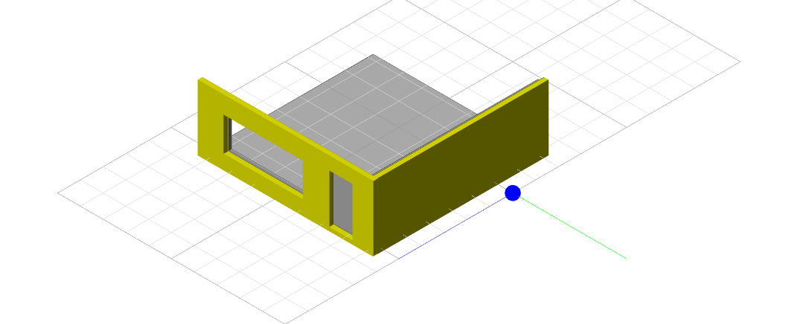
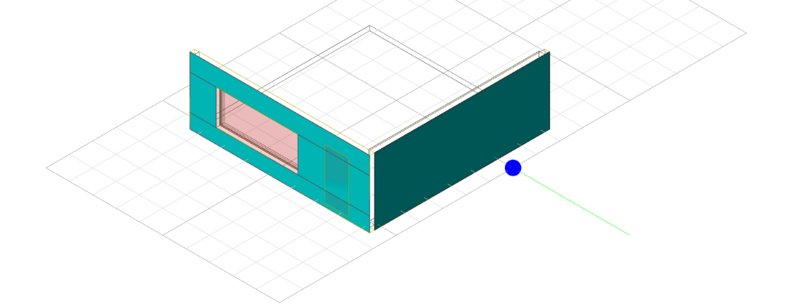
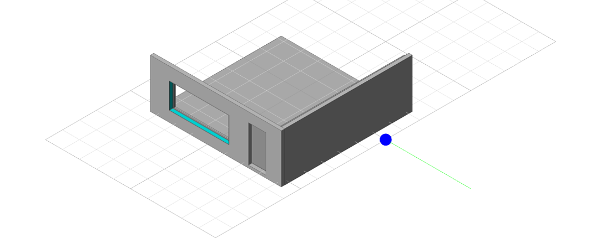
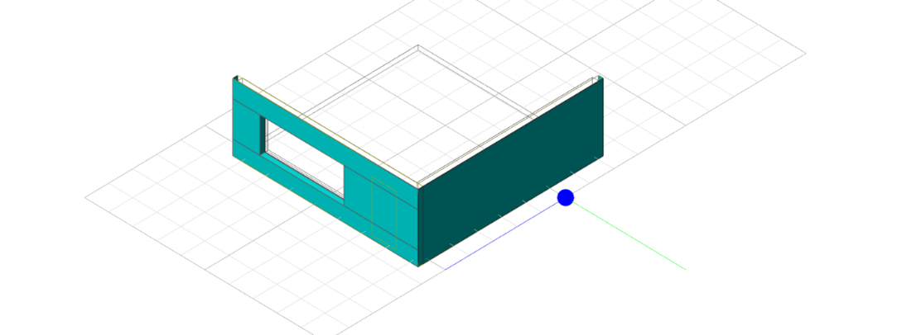

# WDVS aus Polystyrol (EPS-F)

## Was versteht man darunter?

**EPS-F** steht für **Expandierter Polystyrol-Hartschaum für Fassaden**. Dieses Material besteht aus weißen oder grauen Kügelchen, die Luft enthalten und bietet sehr gute Wärmedämmeigenschaften (Lambda = 0,030 - 0,040 W/mK).

Der Wert **my10** in der Leistungsbeschreibung eines WDVS ist eine zentrale Anforderung an das Putzsystem (Armierungsschicht und Oberputz), nicht an den Dämmstoff selbst. Die Anforderung my-Wert kleiner gleich 10 an den Putz zielt darauf ab, ein **sehr diffusionsoffenes WDVS** zu definieren, das Feuchtigkeit besonders gut nach außen abgeben kann. Die gesamte Wandkonstruktion muss nämlich von innen nach außen immer diffusionsoffener werden oder zumindest keinen zu starken Widerstand aufbauen, um Feuchtigkeit nach außen zu transportieren und Tauwasserausfall zu verhindern.

Diese Anforderung wird häufig in Kombination mit EPS spezifiziert, obwohl der EPS-Dämmstoff selbst einen höheren my-Wert (20-60) hat. Dies bedeutet, dass der Hersteller ein System mit diesem Dämmstoff anbietet, bei dem das Putzpaket so dünn und diffusionsoffen ist, dass die gesamte Fassade die Anforderungen an den Feuchteschutz erfüllt (oft auch unter Verwendung gelochter oder geschlitzter Dämmplatten).

**Erlaubt sind:**

Mineralische Putze oder Silikatputze, wobei hier spezielle, besonders offene Rezepturen gefordert sind, die den Wert 10 einhalten, oder es wird der sd-Wert des gesamten Putzpakets auf 0,5 begrenzt.

**Nicht zulässig sind:**

Die meisten **Kunstharzputze** (my-Wert 50-200) oder **Silikonharzputze** (my-Wert 40-80), da diese einen zu hohen Dampf-Diffusionswiderstand haben.

# **Modellvorraussetzung(en)**

Berechnet werden sämtliche Elemente im Modell die mit dem Parameter „**iTWO_Key**“ und dem Parameterwert „**44-WA-EPS**“ gekennzeichnet sind.

Weiters ist darauf zu achten das sämtliche zu berechnenden Öffnungen als „**Opening**“ klassifiziert sind. In unserem Revit - Workflow treffen wir dafür beim Export des Modells u.a. die Exporteinstellung „**Öffnungen beim CPI-Export über „Uplift-Öffnungsberechnung“ erzeugen**“.

Zusätzlich müssen folgende Parameter und Parameterwerte übereinstimmen:

- Parameter **„Wasserdampf- Diffusionswiderstandszahl (my10)“** muss entweder den Wert **0** bzw**. kein Hackerl im Bauteilgenerator** oder **1** bzw. **ein Hackerl im Bauteilgenerator** haben

- Parameter **„Lambdawert“** muss entweder den Wert **0,031** oder **0,040** haben

- Parameter **„Mindestdicke Unterputz“** muss entweder den Wert **5 mm** oder **3 mm** haben

- Das Element muss exakt eine der folgenden Stärken (cm) haben: 3, 5, 6, 8, 10, 12, 14, 16, 18, 20, 22, 24, 26, 28**

# Mengenermittlung in unserer iTWO – Vorlage

**Ausgangspunkt:** Beispielsituation, eine einseitig gedämmte Wandecke im Modell mit einer Türöffnung (kleiner als 4 m², der in der Vorlage voreingestellte Parameterwert bei **AT_PV_AB44** und **AT_PV_AB44_1**) und einer Fensteröffnung (größer gleich 4 m² bzw. der Wert in der Variable).

Die QTO-Formel kombiniert die Berechnungen aus den 3 folgenden Punkten:

1. **Ansichtsfläche:** Zuerst wird die komplette Ansichtsfläche der Fassade ermittelt. Anschließend wird die Ansichtsfläche der großen Öffnung, die von der Abzugsregel nicht betroffen ist (in unserem Fall die Öffnung ab 4 m², rötlich dargestellt) davon subtrahiert. Die errechnete Fläche bzw. Menge wird immer in Türkis angezeigt.

2. **Stirnseiten / Kanten:** Die Kantenflächen ergeben sich aus der Gesamtlänge der seitlichen Begrenzungen des Elements multipliziert mit der jeweiligen Dämmstärke. Sollten Kanten an andere Wandelemente grenzen, wie hier am Eck zur anderen Dämmung, werden diese subtrahiert (mit Lila gekennzeichnet).

3. **Laibungen:** Für die große Öffnung, die bei der Ansichtsfläche nicht abgezogen wurde (in unserem Fall die Öffnung ab 4 m²), wird nun die Laibung gerechnet. Dazu wird der Umfang der Öffnung mit der jeweiligen Dämmstärke multipliziert.

**Ergebnis:**

# 60.10.10.90 zusätzliche Leistungen und Aufzahlungen

## 60.10.10.90.10 Anputzleiste

-  **Kurztext:** **WDVS Fenster/Tür-Anschlussprofil Klasse II**

### **Was versteht man darunter?**

Eine **Anputzleiste** (auch bekannt als Putz-Anschlussprofil oder Fensteranschlussprofil) ist ein spezielles Kunststoffprofil, das beim Verputzen von **Fenster- und Türlaibungen** verwendet wird. Das Hauptziel der Leiste ist es, einen **sauberen, rissfreien und schlagregendichten Anschluss** zwischen dem Putz und dem Fenster- oder Türrahmen zu gewährleisten.

Die Bezeichnung **"Klasse II"** (häufig in der österreichischen **ÖNORM** als **Klasse B** bezeichnet) bezieht sich auf die **Bewegungsaufnahme** und die **Dauerhaftigkeit** des Profils. Im Wesentlichen steht die Klassifizierung für die **Leistungsfähigkeit** der Anputzleiste hinsichtlich der **Rissvermeidung** bei Beanspruchung.

### Modellvorraussetzung(en)

Die QTO-Formel berechnet sämtliche Öffnungen die in Bauteilen mit dem Parameter „**iTWO_Key**“ und dem Parameterwert „**44-WA-EPS**“ im Modell enthalten sind. Zusätzlich muss das Fassadenelement in welchem sich die Öffnungen befinden mit dem Parameter „**cpiComponentType**“ und dem Parameterwert „**Wall**“ gekennzeichnet sein.

Weiters ist darauf zu achten das sämtliche zu berechnenden Öffnungen als „**Opening**“ klassifiziert sind. In unserem Revit - Workflow treffen wir dafür beim Export des Modells u.a. die Exporteinstellung „**Öffnungen beim CPI-Export über „Uplift-Öffnungsberechnung“ erzeugen**“.

### Mengenermittlung in unserer iTWO - Vorlage

Die Berechnung der Anputzleiste für eine einzelne Fenster- oder Türöffnung erfolgt, indem die QTO-Formel die **Breite einmal** und die **Höhe zweimal** abmisst. Die resultierende Gesamtlänge gibt an, wie viele Laufmeter Profil für die Öffnung abgerechnet werden. Damit decken wir die Montage an **3 Seiten der Öffnung** ab.

### 60.10.10.90.20 Az. Brandschutzriegel

#### Kurztext: Az WDVS EPS-F f.Brandschutz MW DD cm

#### Was versteht man darunter?

Ein **Brandschutzsturz** **bzw -riegel** hat den Zweck im Brandfall die Raumabschottung und die Standsicherheit der darüberliegenden Wand für eine definierte Zeit (z.B. 30, 60 oder 90 Minuten) zu gewährleisten. Seine Hauptfunktion ist es, die Brandausbreitung zwischen Brandabschnitten zu verhindern und somit Fluchtwege und die Arbeit der Rettungskräfte zu sichern.

Diese werden primär wird er als einzelner, kurzer Streifen aus nicht brennbarem Material direkt über jeder einzelnen Fenster- und Türöffnung (Sturz) eingebaut. Sie sollen verhindern, dass Flammen, die aus dem Fenster schlagen, in die Dämmebene eindringen und sich vertikal ausbreiten.

#### Modellvorraussetzung(en)

### Mengenermittlung in unserer iTWO - Vorlage

### 60.10.10.90.30 Az. Brandschutzbanderole

#### Kurztext: Az WDVS EPS-F f.Brandschutz MW DD cm

#### Was versteht man darunter?

Ein **Brandschutzsturz bzw -riegel** hat den Zweck im Brandfall die Raumabschottung und die Standsicherheit der darüberliegenden Wand für eine definierte Zeit (z.B. 30, 60 oder 90 Minuten) zu gewährleisten. Seine Hauptfunktion ist es, die Brandausbreitung zwischen Brandabschnitten zu verhindern und somit Fluchtwege und die Arbeit der Rettungskräfte zu sichern.

Diese werden primär wird er als einzelner, kurzer Streifen aus nicht brennbarem Material direkt über jeder einzelnen Fenster- und Türöffnung (Sturz) eingebaut. Sie sollen verhindern, dass Flammen, die aus dem Fenster schlagen, in die Dämmebene eindringen und sich vertikal ausbreiten.

Hierbei handelt es sich um eine durchgängige, horizontale, den gesamten Umfang des Gebäudes umfassende Schicht aus nicht brennbarem Material (meist Mineralwolle). Sie wird in der Regel über jedem zweiten Geschoss (oder in bestimmten Abständen) angebracht und ist eine Alternative zum Brandschutzriegel bzw. -sturz.

Die "Banderole" ist also eine Art des Brandriegels, nämlich die umlaufende Variante, die anstelle der vielen einzelnen Sturzriegel gewählt werden kann.